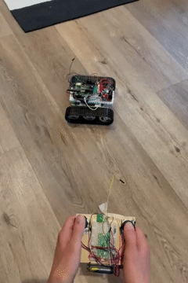
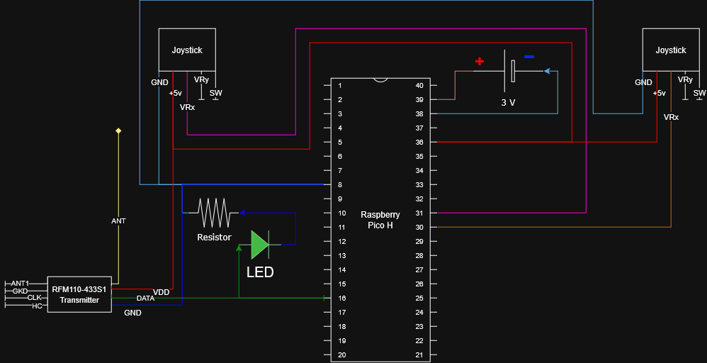
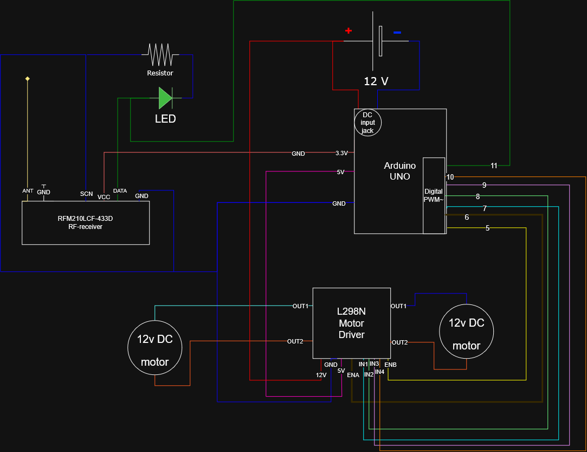

# RC-Track-Vehicle
Radio controlled vehicle with tracks

## Part list Controller:
- Raspberry Pico H
- 3 V powersupply
  - battery holder for 2 AA batteries
- 2 joysticks
- led
- resistor
- RFM110-433S1
  - 433MHz RF-transmitter OOK 3,3V SMD 13dBm
HOPE Microelectronics 
- breadboard
- foam (cushion between joysticks and controller base)

## Part list track vehicle
- Track chasis
- 2x 12 volt DC motors
- Arduino Uno
- L298N motor driver module
- RFM210LCF-433D
  - 433MHz RF-receiver OOK 3,3V Low power HOPE Microelectronics
- breadboard (preferably double sized)
- 12 v powersupply
  - battery holder for 8 AA batteries
  - 5.5mm 2.1mm dc plug
- led
- resistor

## Misc parts & tools
- wires
- piece of wood (for controller)
- small screws
- tape
- iron wire
- multimeter
- crocodile clips
- USB-A to Micro-USB cable
- USB-A to USB-B cable
- Soldering iron, solder, flux

## Software
- Arduino IDE
- RadioHead softare library

## Circuit Diagrams

### Controller

### Track vehicle
